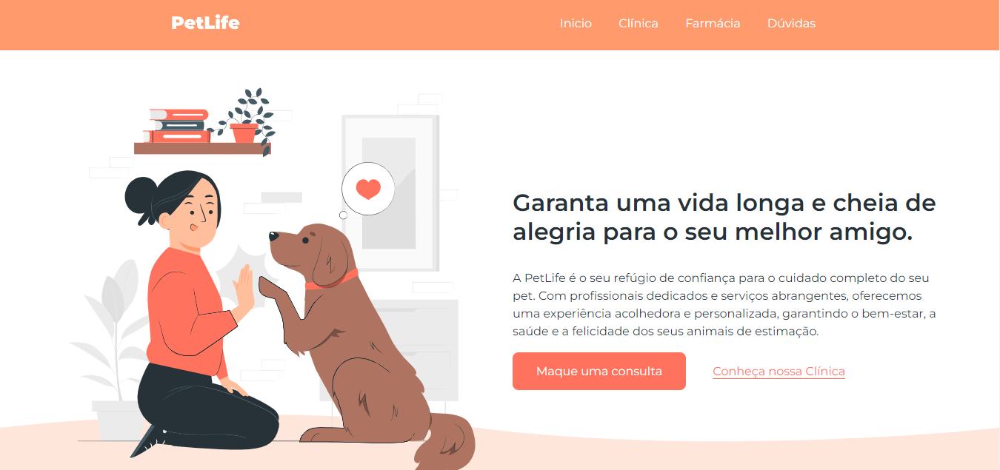

<h1 align="center"> PetLife </h1>

Landin Page para um PetShop 

  

 

  

## 🚀 Tecnologias

Esse projeto foi desenvolvido com as seguintes tecnologias:

- HTML e CSS
- JavaScript
- Git e Github

## 💻 Projeto

Landing Page para um PetShop fictício contendo diversas informações relevantes!

- [Visite o projeto online]()

## 🔖 Layout

Layout produzido por <a href="https://www.onebitcode.com/">OneBitCode</a>

---
